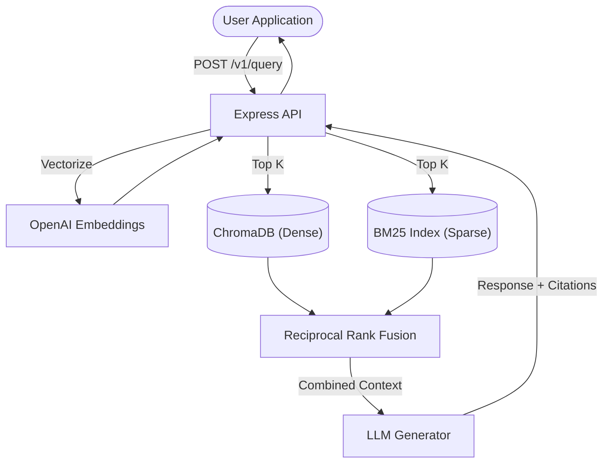

# Architecture — hybrid-rag-pipeline
> Last updated: 2026-08-29 | Maturity: Full Prototype
> _Hybrid RAG system using Dense + Sparse retrieval with RRF._

## System Diagram
The following Mermaid.js sequence diagram maps the core workflow and interactions:

## Component Table

| Component | File | Responsibility | Tech |
|---|---|---|---|
| API Server | `src/server.ts` | Express server handling ingestion and queries | Node.js |
| Retriever | `src/retrieval.ts` | Manages querying both DBs and executing RRF | TypeScript |
| BM25 Engine | `src/bm25.ts` | In-memory inverted index for sparse search | TypeScript |
| Vector DB | `src/chroma.ts` | Interface to ChromaDB | TypeScript |

## Port Assignments

| Service | Port | Notes |
|---|---|---|
| RAG API | `3000` | Main entrypoint |
| ChromaDB | `8000` | Local vector store |

## Dependency Honesty Table

| Dependency | Status | Notes |
|---|---|---|
| OpenAI API | **Optional** | Requires key for real embeddings/generation. Simulated in test mode. |
| ChromaDB | **Real** | Run locally via Docker Compose. |

## Core Components

### 1. Ingestion Pipeline
- **Loaders**: Support for text, markdown, HTML (via Cheerio to strip styles/scripts), and PDF (via `pdf-parse`).
- **Chunking**: Configurable strategies including standard fixed-size chunking with overlaps, recursive chunking based on paragraphs/double newlines, and sentence-level fallback "semantic" chunking.

### 2. Storage & Indexes
- **Dense Vector Store (ChromaDB)**: Embeds chunks using OpenAI's `text-embedding-3-small` and stores them in ChromaDB. Uses HNSW indexes for fast, approximate nearest neighbor (ANN) cosine similarity matching.
- **Sparse Inverted Index (BM25)**: A custom TypeScript implementation of the classic BM25 TF-IDF algorithm. Highly effective at finding specific technical jargon, acronyms, or proper nouns that dense embeddings occasionally gloss over.

### 3. Hybrid Search via Reciprocal Rank Fusion (RRF)
RRF solves the problem of comparing incompatible scoring systems (Cosine similarity vs BM25 score). It does this by ignoring the absolute scores and instead fusing based on the *rank position* in both lists.
`RRF_Score = 1 / (60 + rank)`
Chunks appearing highly ranked in *both* semantic and keyword searches receive a significant score boost, ensuring maximum relevance.

### 4. Generation & Citations
The generation step receives the top-K fused chunks. We inject the exact chunk IDs directly into the LLM system prompt. 
By heavily prompting the model to reference these IDs using a specific format (e.g., `[ID: 1234-abcd]`), we enforce grounding and traceability, dramatically reducing hallucinations in the final RAG output.

## Trade-offs and Considerations
1. **In-Memory BM25**: Currently, the BM25 store is in-memory. For a massive document corpus, this should be swapped with ElasticSearch or Meilisearch. However, for a lightweight, easily deployable RAG API handling thousands of documents, in-memory BM25 with Node.js V8 engine performance is sufficient.
2. **Synchronous Embedding API Calls**: During ingestion, embeddings are requested synchronously. In a true enterprise-scale deployment, this would be offloaded to an asynchronous message queue (e.g., RabbitMQ/Celery or AWS SQS) to prevent HTTP timeouts on massive PDFs.